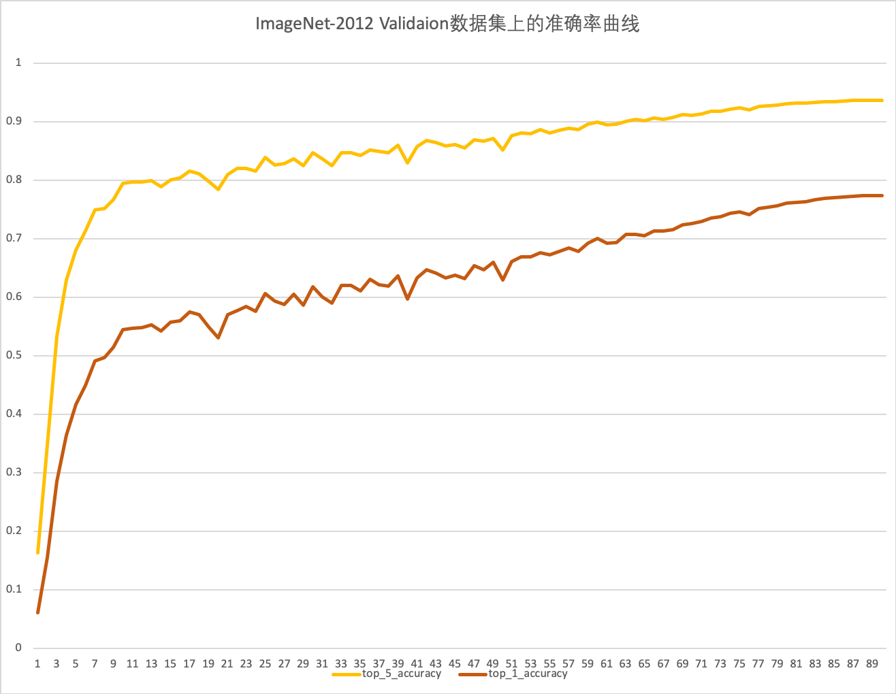
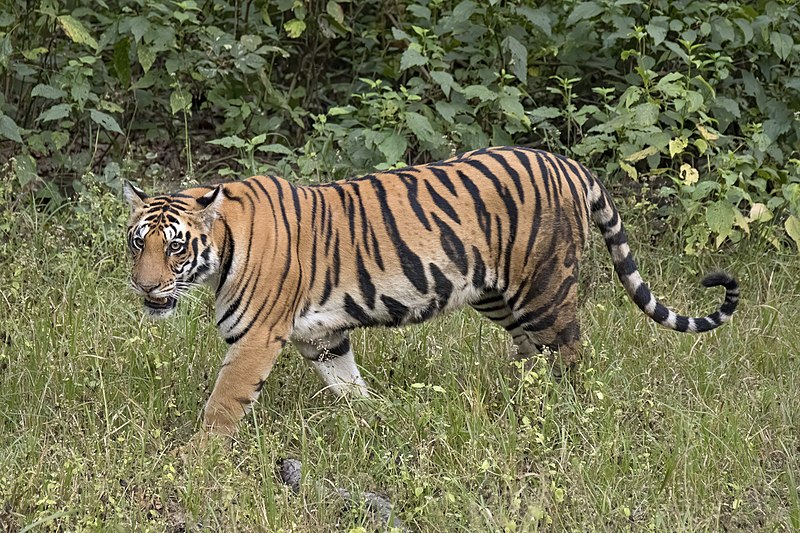

## 简介 Introduction

## 图像分类与CNN

**图像分类** 是指将图像信息中所反映的不同特征，把不同类别的目标区分开来的图像处理方法，是计算机视觉中其他任务，比如目标检测、语义分割、人脸识别等高层视觉任务的基础。

ImageNet大规模视觉识别挑战赛（ILSVRC），常称为ImageNet竞赛，包括图像分类、物体定位，以及物体检测等任务，是推动计算机视觉领域发展最重要的比赛之一。

在2012年的ImageNet竞赛中，深度卷积网络AlexNet横空出世。以超出第二名10%以上的top-5准确率，勇夺ImageNet2012比赛的冠军。从此，以 CNN（卷积神经网络） 为代表的深度学习方法开始在计算机视觉领域的应用开始大放异彩，更多的更深的CNN网络被提出，比如ImageNet2014比赛的冠军VGGNet, ImageNet2015比赛的冠军ResNet。

OneFlow-Benchmark下的cnn仓库目前已支持 **Alexnet** 、 **VGG16** 、 **Resnet50** 、　**InceptionV3** 、　**MobileNetV2**等经典的cnn模型，未来会陆续添加新的cnn模型。这些cnn模型共享一套训练、验证和推理代码，您只需要指定模型，即可使用一套代码完成这些cnn网络模型的训练、测试和验证。


## 快速开始 Quick Start

### 准备工作 Requirements

别担心，使用OneFlow非常容易，只要准备好下面三步，即可开始OneFlow的图像识别之旅。

- 安装OneFlow。 

  - 直接通过pip安装：`pip install oneflow`  
  - 安装轻量版：`pip install --find-links https://oneflow-inc.github.io/nightly oneflow`
  - 源码编译等其他安装方式：参考[OneFlow项目主页](https://github.com/Oneflow-Inc/oneflow)

- 克隆/下载[OneFlow-Benchmark](https://github.com/Oneflow-Inc/OneFlow-Benchmark)仓库。

  `git clone git@github.com:Oneflow-Inc/OneFlow-Benchmark.git`

- 准备数据集（可选）

  - 直接使用synthetic虚拟合成数据集
  - 下载我们制作的Imagenet(2012)[迷你数据集](https://oneflow-public.oss-cn-beijing.aliyuncs.com/online_document/dataset/imagenet/mini-imagenet.zip) 解压放入data目录
  - 或者：制作完整OFRecord格式的ImageNet数据集（见下文进阶部分）
  

我们提供了通用脚本：train.sh和inference.sh，它们适用于此仓库下所有cnn网络模型的训练、验证、推理。您可以通过设置参数使用不同的模型、数据集来训练/推理。

 **关于模型的说明：** 

> 默认情况下，我们使用resnet50，您也可以通过改动脚本中的--model参数指定其他模型，如：--model="resnet50"，--model="vgg"等。

**关于数据集的说明：**


> 1）为了使读者快速上手，我们提供了synthetic虚拟合成数据，“合成数据”是指不通过磁盘加载数据，而是直接在内存中生成一些随机数据，作为神经网络的数据输入源。
>
> 2）同时，我们提供了一个小的迷你示例数据集。直接下载解压至cnn项目的root目录，即可快速开始训练。读者可以在熟悉了流程后，参考数据集制作部分，制作完整的Imagenet2012数据集。
>
> 3）使用OFRcord格式的数据集可以提高数据加载效率（但这非必须，参考[数据输入](https://github.com/Oneflow-Inc/oneflow-documentation/blob/master/cn/docs/basics_topics/data_input.md)，oneflow支持直接加载numpy数据）。


### 预训练模型

#### Resnet50

[resnet50_v1.5_model](https://oneflow-public.oss-cn-beijing.aliyuncs.com/model_zoo/resnet_v15_of_best_model_val_top1_77318.tgz ) (validation accuracy: 77.318% top1，93.622% top5 )

#### VGG16

[vgg16_model](https://oneflow-public.oss-cn-beijing.aliyuncs.com/model_zoo/vgg16_of_best_model_val_top1_721.zip) (validation accuracy: 72.1% top1，92.7% top5 )

#### Alexnet

[alexnet_model](https://oneflow-public.oss-cn-beijing.aliyuncs.com/model_zoo/alexnet_of_best_model_val_top1_54762.zip) (validation accuracy: 54.762% top1，78.1914% top5 )

#### InceptionV3 

[inceptionv3_model](https://oneflow-public.oss-cn-beijing.aliyuncs.com/model_zoo/inceptionv3_of_best_model_val_top1_74.19.zip) (validation accuracy: 74.19% top1，91.46% top5 )


### 预测/推理

下载预训练模型：[resnet50_v1.5_model](https://oneflow-public.oss-cn-beijing.aliyuncs.com/model_zoo/resnet_v15_of_best_model_val_top1_77318.tgz ) ，解压后放入当前目录，然后执行：

```shell
sh inference.sh
```

脚本执行后，将对下面的图片进行分类：


<div align="center">
    
</div>

 **输出**  

```shell
data/fish.jpg
0.87059885 goldfish, Carassius auratus
```

可见，模型判断这张图片有87.05%的概率是金鱼goldfish


### 训练&验证

训练同样很简单，只需执行：

```shell
sh train.sh
```

即可开始模型的训练，您将看到如下输出：

```shell
Loading synthetic data.
Loading synthetic data.
Saving model to ./output/snapshots/model_save-20200723124215/snapshot_initial_model.
Init model on demand.
train: epoch 0, iter 10, loss: 7.197278, top_1: 0.000000, top_k: 0.000000, samples/s: 61.569
train: epoch 0, iter 20, loss: 6.177684, top_1: 0.000000, top_k: 0.000000, samples/s: 122.555
Saving model to ./output/snapshots/model_save-20200723124215/snapshot_epoch_0.
train: epoch 0, iter 30, loss: 3.988656, top_1: 0.525000, top_k: 0.812500, samples/s: 120.337
train: epoch 1, iter 10, loss: 1.185733, top_1: 1.000000, top_k: 1.000000, samples/s: 80.705
train: epoch 1, iter 20, loss: 1.042017, top_1: 1.000000, top_k: 1.000000, samples/s: 118.478
Saving model to ./output/snapshots/model_save-20200723124215/snapshot_epoch_1.
...
```

>  为了方便运行演示，我们默认使用synthetic虚拟合成数据集，使您可以快速看到模型运行的效果

同样，你也可以使用[迷你示例数据集](https://oneflow-public.oss-cn-beijing.aliyuncs.com/online_document/dataset/imagenet/mini-imagenet.zip)，下载解压后放入cnn项目的root目录即可，然后修改训练脚本如下：

```shell
rm -rf core.* 
rm -rf ./output/snapshots/*

DATA_ROOT=data/mini-imagenet/ofrecord

# training with mini-imagenet
DATA_ROOT=data/mini-imagenet/ofrecord
python3 of_cnn_train_val.py \
   --train_data_dir=$DATA_ROOT/train \
   --num_examples=50 \
   --train_data_part_num=1 \
   --val_data_dir=$DATA_ROOT/validation \
   --num_val_examples=50 \
   --val_data_part_num=1 \
   --num_nodes=1 \
   --gpu_num_per_node=1 \
   --optimizer="sgd" \
   --momentum=0.875 \
   --learning_rate=0.001 \
   --loss_print_every_n_iter=1 \
   --batch_size_per_device=16 \
   --val_batch_size_per_device=10 \
   --num_epoch=10 \
   --model="resnet50"
```

运行此脚本，将在仅有50张金鱼图片的迷你imagenet数据集上，训练出一个分类模型，利用它，你可以对金鱼图片进行分类。

训练完成后，你也可以修改evaluate.sh脚本以对模型进行评估：

```shell
#!/bin/bash
# Evaluate with mini-imagenet
DATA_ROOT=data/mini-imagenet/ofrecord
MODEL_LOAD_DIR="output/snapshots/model_save-20200907130848/snapshot_epoch_9"
python3  of_cnn_evaluate.py \
    --num_epochs=3 \
    --num_val_examples=50 \
    --model_load_dir=$MODEL_LOAD_DIR  \
    --val_data_dir=$DATA_ROOT/validation \
    --val_data_part_num=1 \
    --num_nodes=1 \
    --gpu_num_per_node=1 \
    --val_batch_size_per_device=10 \
    --model="resnet50"
```

恭喜你，得到了这个还不错的金鱼分类模型，想尝试在完整imagenet上训练自己的分类模型吗？

不要着急，如果您需要在完整的ImageNet2012数据集上进行训练，请看下文【ResNet】部分的介绍。其中，我们将重点介绍其中的经典网络：Resnet50，以及如何利用OneFlow在完整的Imagenet2012数据集上训练Resnet50，并提供 **对标Nvidia的Mxnet版** 实现。


## ResNet

[ResNet](https://arxiv.org/abs/1512.03385) 是2015年ImageNet竞赛的冠军。目前，ResNet相对对于传统的机器学习分类算法而言，效果已经相当的出色，之后大量的检测，分割，识别等任务也都在ResNet基础上完成。

[OneFlow-Benchmark](https://github.com/Oneflow-Inc/OneFlow-Benchmark)仓库中，我们提供了ResNet50 v1.5的OneFlow实现。该实现对标了[英伟达的Mxnet版实现](https://github.com/NVIDIA/DeepLearningExamples/tree/master/MxNet/Classification/RN50v1.5)。我们在ImageNet-2012数据集上训练90轮后，验证集上的准确率能够达到：77.318%(top1)，93.622%(top5)  更详细的网络参数对齐工作，见下面【进阶 Advanced】部分。





**关于ResNet50 v1.5的说明：**

> ResNet50 v1.5是原始[ResNet50 v1](https://arxiv.org/abs/1512.03385)的一个改进版本，相对于原始的模型，精度稍有提升 (~0.5% top1)，详细说明参见[这里](https://github.com/NVIDIA/DeepLearningExamples/tree/master/MxNet/Classification/RN50v1.5) 。


准备好亲自动手，复现上面的结果了吗？那么接下来，立马开始OneFlow的图像识别之旅吧！

下面，本文就以上面的ResNet50 为例，一步步展现如何使用OneFlow进行网络的训练和预测。

### 训练和验证（Train & Validation）

训练开始前，需要提前准备好数据集，具体见上面的【准备工作 Requirements】部分，准备好之后就可以进行下面的步骤了。

先切换到代码目录：

```shell
cd OneFlow-Benchmark/Classification/cnns
```

在train.sh脚本设置训练参数(以下为示例，具体参数可自行设置)：

```shell
rm -rf core.* 
rm -rf ./output/snapshots/*

# training with imagenet
 DATA_ROOT=/datasets/ImageNet/ofrecord
 LOG_FOLDER=../logs
 mkdir -p $LOG_FOLDER
 LOGFILE=$LOG_FOLDER/resnet_training.log

python3 of_cnn_train_val.py \
     --train_data_dir=$DATA_ROOT/train \
     --train_data_part_num=256 \
     --val_data_dir=$DATA_ROOT/validation \
     --val_data_part_num=256 \
     --num_nodes=1 \
     --gpu_num_per_node=4 \
     --optimizer="sgd" \
     --momentum=0.875 \
     --label_smoothing=0.1 \
     --learning_rate=0.256 \
     --loss_print_every_n_iter=100 \
     --batch_size_per_device=64 \
     --val_batch_size_per_device=50 \
     --num_epoch=90 \
     --model="resnet50" 2>&1 | tee ${LOGFILE}

echo "Writting log to ${LOGFILE}" 
```

**参数说明**(部分)

- --train_data_dir                Imagenet2012训练集文件夹路径(ofrecord格式)
- --train_data_part_num   训练所用的ofrecord分片数量
- --val_data_dir                    Imagenet2012验证集文件夹路径(ofrecord格式)
- --val_data_part_num       验证所用的ofrecord分片数量
- --num_nodes                    训练使用的机器节点数
- --gpu_num_per_node      每个机器节点使用的gpu数量
- --optimizer                                 优化器，默认sgd
- --label_smoothing                     是否使用标签平滑处理
- --learning_rate                           初始学习率
- --loss_print_every_n_iter          打印loss间隔 
- --batch_size_per_device            训练时每个gpu的batch大小
- --val_batch_size_per_device     验证时每个gpu的batch大小
- --num_epoch                              迭代总轮数
- --model                                        使用的模型，可选：resnet50、vgg、alexnet、inceptionv3

然后在命令行执行：

```shell
sh train.sh
```

若在屏幕上不断打印出类似下面的信息，则表明训练过程正常运行：

```
train: epoch 0, iter 200, loss: 7.024337, top_1: 0.000957, top_k: 0.005313, samples/s: 964.656
train: epoch 0, iter 400, loss: 6.849526, top_1: 0.003594, top_k: 0.012969, samples/s: 991.474
...
train: epoch 0, iter 5000, loss: 5.557458, top_1: 0.064590, top_k: 0.174648, samples/s: 935.390
Saving model to ./output/snapshots/model_save-20200629223546/snapshot_epoch_0.
validation: epoch 0, iter 100, top_1: 0.074620, top_k: 0.194120, samples/s: 2014.683
```

可以看到：

- 随着训练的进行，loss不断下降，而训练的top_1/top_k准确率不断提高（其中top_k默认为top_5准确率，可自定义）。
- 每个epoch结束时，会做另外两个工作：1）执行一次验证，并打印出验证集上的top_1/top_k准确率；2）保存模型。
- samples/s 用来指示训练/验证的执行速度，即每秒钟能处理的图片数量。

**复现实验的说明：**

> Q1. 多久能够完成训练？
>
> 在GPU环境下，使用单机8卡（NVIDIA TITAN V），完成90个epoch的完整训练过程，大概需要15小时。
>
> Q2. 在ImageNet-2012数据集上训练90个epoch后，准确率能达到多少？
>
> 训练集：80.57%（top1）
>
> 验证集：77.318%（top1），93.622%（top5）


### 预测（Inference）

恭喜，到这里，您已经知道如何用OneFlow训练模型，接下来，试试用训练好的模型对新图片进行分类预测吧！

在预测之前， **关于模型，您可以选择：**

- 自己训练的模型(如：./output/snapshots/model_save-20200723124724/snapshot_epoch_89)

- 下载我们训练好的模型：[resnet_v1.5_model](https://oneflow-public.oss-cn-beijing.aliyuncs.com/model_zoo/resnet_v15_of_best_model_val_top1_77318.tgz ) (validation accuracy: 77.318% top1，93.622% top5 )

  

准备好模型后，将模型目录填入`inference.sh` 脚本的`MODEL_LOAD_DIR`变量中，然后执行inference.sh脚本，开始对图片`data/tiger.jpg`的类别的进行预测：

```shell
sh inference.sh
```

若输出下面的内容，则表示预测成功：

```shell
data/tiger.jpg
0.81120294 tiger, Panthera tigris
```

**参数说明**(部分)

- --model 指定要加载的模型
- --image_path 待检测图片路径
- --model_load_dir 模型文件路径

### 评估（Evaluate）

在测试了单张图片之后，想试试模型精度有没有达到 **SOTA** (State Of The Art)? 只需运行：
```shell
sh evaluate.sh
```
即可获得训练好的模型在50000张验证集上的准确率：
```shell
Time stamp: 2020-07-27-09:28:28
Restoring model from resnet_v15_of_best_model_val_top1_77318.
I0727 09:28:28.773988162    8411 ev_epoll_linux.c:82]        Use of signals is disabled. Epoll engine will not be used
Loading data from /dataset/ImageNet/ofrecord/validation
validation: epoch 0, iter 195, top_1: 0.773277, top_k: 0.936058, samples/s: 1578.325
validation: epoch 0, iter 195, top_1: 0.773237, top_k: 0.936078, samples/s: 1692.303
validation: epoch 0, iter 195, top_1: 0.773297, top_k: 0.936018, samples/s: 1686.896
```

从3轮的评估结果来看，我们的模型在Imagenet(2012)上已经达到了77.32+%的top_1精度。


最后，恭喜你！完成了Resnet模型在ImageNet上完整的训练/验证、推理和评估，为自己鼓个掌吧！


## 更详细的说明 Details

### 分布式训练
**简单而易用的分布式，是OneFlow的主打特色之一。**

OneFlow框架从底层设计上，就原生支持高效的分布式训练。尤其对于分布式的数据并行，用户完全不用操心算法从单机单卡扩展到多机多卡时，数据如何划分以及同步的问题。也就是说，使用OneFlow，用户以单机单卡的视角写好算法，**自动具备多机多卡分布式数据并行的能力。**


#### 如何配置并运行分布式训练？
还是以上面"快速开始"部分演示的代码为例，在`train.sh`中，只要用`--num_nodes` 指定节点（机器）个数，同时用`--node_ips`指定节点的ip地址，然后用`--gpu_num_per_node`指定每个节点上使用的卡数，就轻松地完成了分布式的配置。

例如，想要在2机8卡上进行分布式训练，像下面这样配置：

```shell
# train.sh 
python3 of_cnn_train_val.py \
    --num_nodes=2 \
    --node_ips="192.168.1.1, 192.168.1.2"
    --gpu_num_per_node=4 \
    ...
    --model="resnet50"
```

然后分别在两台机器上，同时执行：
```shell
./train.sh
```

程序启动后，通过`watch -n 0.1 nvidia-smi`命令可以看到，两台机器的GPU都开始了工作。一段时间后，会在`--node_ips`设置中的第一台机器的屏幕上，打印输出。


### 混合精度训练与预测

目前，OneFlow已经原生支持半精度/全精度的混合精度训练。训练时，模型参数（权重）使用float16进行训练，同时保留float32用作梯度更新和计算过程。由于参数的存储减半，会带来训练速度的提升。

在OneFlow中开启半精度/全精度的混合精度训练模式，ResNet50的训练速度理论上能达到`1.7`倍的加速。


#### 如何开启半精度/全精度混合精度训练？

只需要在`train.sh`脚本中添加参数`--use_fp16=True`即可。

#### 混合精度模型

我们为您提供了一个在Imagenet2012完整训练了90个epoch的混合精度模型，top_1：77.33%

您可以直接下载使用：[resnet50_v15_fp16](https://oneflow-public.oss-cn-beijing.aliyuncs.com/model_zoo/resnet_fp16_of_best_model_val_top1_77330.zip)


### 训练过程可视化

Oneflow支持将训练生成的中间结果以日志文件的形式保存到本地，可视化后端通过实时读取日志文件，将训练过程产生的数据实时展示到可视化前端。

目前，Oneflow支持的可视化类型分为以下几种：

| 可视化类型 | 描述                     |
| ---------- | ------------------------ |
| 模型结构   | 结构图、计算图(后续支持) |
| 标量数据   | 标量数据                 |
| 媒体数据   | 文本、图像               |
| 统计分析   | 数据直方图、数据分布图   |
| 降维分析   | 数据降维                 |
| 超参分析   | 超参数                   |
| 异常检测   | 异常数据检测             |

具体使用方式可参考test_summary.py 文件

具体可视化效果参考[之江天枢人工智能开源平台](http://tianshu.org.cn/?/course)用户手册可视化部分


## 进阶 Advanced

### 参数对齐

Oneflow的ResNet50实现，为了保证和[英伟达的Mxnet版实现](https://github.com/NVIDIA/DeepLearningExamples/tree/master/MxNet/Classification/RN50v1.5)对齐，我们从learning rate学习率，优化器Optimizer的选择，数据增强的图像参数设定，到更细的每一层网络的形态，bias,weight初始化等都做了细致且几乎完全一致的对齐工作。

#### Data Augmentation

**训练**

1. 随机采样图像并将其解码为[0; 255]。
2. 随机裁剪一个矩形区域，该矩形区域的长宽比以[3/4; 4/3]和以[8％；100％]，然后将裁剪的区域调整为224 x 224平方的图像。
3. 以0.5的概率水平翻转。
4. 色彩增强，比例色相，饱和度和亮度，其系数从[0.6; 1.4]。
5. 将PCA噪声与从正态分布N（0，0.1）采样的系数相加。
6. 通过分别减去123.68、116.779、103.939并除以58.393、57.12、57.375来标准化RGB通道。
7. 调整图像的大小，使其较短的一面在[256，480]中随机采样以进行缩放。随机抽取224×224区域。

| item                     | oneflow | nvidia |
| ------------------------ | ------- | ------ |
| 1 random sample          | Yes     | Yes    |
| 2 random crop resize     | Yes     | Yes    |
| 7 short side resize crop | No      | No     |
| 3 Flip horizontally      | Yes     | Yes    |
| 4 Color augmentation     | No      | No     |
| 5 PCA Noise              | No      | No     |
| 6.1 Normalize mean       | Yes     | Yes    |
| 6.2 Normalize std        | Yes     | Yes    |

**验证**

- 将每个图像的短边调整为256像素，同时保持其宽高比。
- 裁剪中心的224×224区域
- 标准化RGB通道，类似于训练。

#### Learning Rate Schedule

Oneflow保持了和Mxnet一致的初始学习率以及衰减方式。具体来说，我们采用了5个epoch的warmup，初始学习率lr = 0.256，lr衰减方式采用cosine decay（初始lr可根据batch_size和gpu数量可线性缩放）

- warmup + cosine decay
- warmup + step decay

<div align="center">
    
</div>


| item        | oneflow | nvidia  |
| ----------- | ------- | ------ |
| start lr    | 0.256   | 0.256  |
| lr schedule | cosine  | cosine  |

#### Optimizer

| oneflow  | nvidia   |
| -------- | -------- |
| momentum | momentum |

#### Weight Initializer

OneFlow和英伟达保持了相同的初始化方式，只是在两个框架中部分api的名称不同。

| variable    | oneflow       | nvidia                       |
| ----------- | ------------- | ---------------------------- |
| conv weight | random_normal | Xavier( 'gaussian', 'in', 2) |
| conv bias   | NA            | NA                           |
| fc weight   | random_normal | Xavier( 'gaussian', 'in', 2) |
| fc bias     | 0             | 0                            |
| bn gamma    | 1             | 1                            |
| bn beta     | 0             | 0                            |

#### Weight Decay

| item         | oneflow   | nvidia    |
| ------------ | --------- | --------- |
| weight_decay | 1.0/32768 | 1.0/32768 |
| conv weight  | Yes       | Yes       |
| conv bias    | NA        | NA        |
| fc weight    | Yes       | Yes       |
| fc bias      | Yes       | NA        |
| bn gamma     | No        | No        |
| bn beta      | No        | No        |

#### Batch Norm

| param    | oneflow | nvidia |
| -------- | ------- | ------ |
| momentum | 0.9     | 0.9    |
| epsilon  | 1e-5    | 1e-5   |

#### Label Smoothing

| item            | oneflow | nvidia |
| --------------- | ------- | ------ |
| label smoothing | 0.1     | 0.1    |

###  数据集制作

#### 用于图像分类数据集简介

用于图像分类的公开数据集有CIFAR，ImageNet等等，这些数据集中，是以jpeg的格式提供原始的图片。

- [CIFAR](http://www.cs.toronto.edu/~kriz/cifar.html)
  是由Hinton 的学生Alex Krizhevsky 和Ilya Sutskever 整理的一个用于识别普适物体的小型数据集。包括CIFAR-10和CIFAR-100。

- [ImageNet](http://image-net.org/index) 
	ImageNet数据集，一般是指2010-2017年间大规模视觉识别竞赛(ILSVRC)的所使用的数据集的统称。ImageNet数据从2010年来稍有变化，常用ImageNet-2012数据集包含1000个类别，其中训练集包含1,281,167张图片，每个类别数据732至1300张不等，验证集包含50,000张图片，平均每个类别50张图片。

完整的ImageNet(2012)制作过程，请参考tools目录下的[README说明](./tools/README.md)


### OneFlow 模型转 ONNX 模型

#### 简介

 **ONNX (Open Neural Network Exchange)**  是一种较为广泛使用的神经网络中间格式，通过 ONNX 格式，OneFlow 模型可以被许多部署框架（如 OpenVINO、ONNX Runtime 和移动端的 ncnn、tnn、TEngine 等）所使用。这一节介绍如何将训练好的 resnet50 v1.5 模型转换为 ONNX 模型并验证正确性。

#### 快速上手

我们提供了完整代码：[resnet\_to\_onnx.py](https://github.com/Oneflow-Inc/OneFlow-Benchmark/blob/master/Classification/cnns/resnet_to_onnx.py)  帮你轻松完成模型的转换和测试的工作

 **步骤一：** 下载预训练模型：[resnet50_v1.5_model](https://oneflow-public.oss-cn-beijing.aliyuncs.com/model_zoo/resnet_v15_of_best_model_val_top1_77318.tgz ) ，解压后放入当前目录

 **步骤二：** 执行：`python3 resnet_to_onnx.py `

此代码将完成OneFlow模型->ONNX模型的转化，然后使用ONNX Runtime加载转换后的模型对单张图片进行测试。测试图片如下：

<div align="center">
    
</div>

> ​                                             图片来源：https://en.wikipedia.org/wiki/Tiger

输出：

```python
Convert to onnx success! >>  onnx/model/resnet_v15_of_best_model_val_top1_77318.onnx
data/tiger.jpg
Are the results equal? Yes
Class: tiger, Panthera tigris; score: 0.8112028241157532
```


#### 如何生成 ONNX 模型

**步骤一：指定模型路径**  

首先指定待转换的OneFlow模型路径，然后指定转换后的ONNX模型存放路径，例如示例中：

```python
# set up your model path
flow_weights_path = 'resnet_v15_of_best_model_val_top1_77318'
onnx_model_dir = 'onnx/model'
```

**步骤二：新建一个用于推理的 job function**

然后新建一个用于推理的 job function，它只包含网络结构本身，不包含读取 OFRecord 的算子，并且直接接受 numpy 数组形式的输入。可参考 resnet\_to\_onnx.py 中的 `InferenceNet`

**步骤三：调用 flow.onnx.export 方法**

接下来代码中会调用`oneflow_to_onnx()`方法，此方法包含了核心的模型转换方法： `flow.onnx.export()` 

 **flow.onnx.export** 将从 OneFlow 网络得到 ONNX 模型，它的第一个参数是上文所说的专用于推理的 job function，第二个参数是OneFlow模型路径，第三个参数是（转换后）ONNX模型的存放路径

```python
onnx_model = oneflow_to_onnx(InferenceNet, flow_weights_path, onnx_model_dir, external_data=False)
```

#### 验证 ONNX 模型的正确性

生成 ONNX 模型之后可以使用 ONNX Runtime 运行 ONNX 模型，以验证 OneFlow 模型和 ONNX 模型能够在相同的输入下产生相同的结果。相应的代码在 resnet\_to\_onnx.py 的 `check_equality`。

#### 训练AlexNet

```
#Please change $DATA_ROOT this to your own data root.
python3 of_cnn_train_val.py \
    --train_data_dir=$DATA_ROOT/train \
    --val_data_dir=$DATA_ROOT/validation \
    --train_data_part_num=256 \
    --val_data_part_num=256 \
    --num_nodes=1 \
    --gpu_num_per_node=1 \
    --optimizer="sgd" \
    --momentum=0.9 \
    --learning_rate=0.01 \
    --loss_print_every_n_iter=100 \
    --batch_size_per_device=512 \
    --val_batch_size_per_device=512 \
    --num_epoch=90 \
    --use_fp16=false \
    --model="alexnet" \
```

经过90个epochs的训练后，oneflow模型的top1准确率和top5准确率分别为54.762％和78.1914％。 作为对比，经过90个训练周期后，来自tensorflow基准的模型的top1准确率和top5准确率分别为54.6％和78.33％。


#### 训练 VGG-16
```
#Please change $DATA_ROOT this to your own data root.
python3 cnn_benchmark/of_cnn_train_val.py \
    --train_data_dir=$DATA_ROOT/train \
    --val_data_dir=$DATA_ROOT/validation \
    --train_data_part_num=256 \
    --val_data_part_num=256 \
    --num_nodes=1 \
    --gpu_num_per_node=4 \
    --optimizer="sgd" \
    --momentum=0.9 \
    --learning_rate=0.01 \
    --loss_print_every_n_iter=10 \
    --batch_size_per_device=128 \
    --val_batch_size_per_device=128 \
    --num_epoch=90 \
    --use_fp16=false \
    --model="vgg" \
```

经过90个epochs的训练后，oneflow模型的top1准确率和top5准确率分别为72.1％和90.7％。 作为对比，经过90轮epochs的训练后的tensorflow基准模型的top1准确率和top5准确率分别为71.5％和89.9％。


## 训练 InceptionV3
```
#Please change $DATA_ROOT this to your own data root.
python3 of_cnn_train_val.py \
    --train_data_dir=$DATA_ROOT/train \
    --val_data_dir=$DATA_ROOT/validation \
    --train_data_part_num=256 \
    --val_data_part_num=256 \
    --num_nodes=1 \
    --gpu_num_per_node=1 \
    --optimizer="rmsprop"  \
    --epsilon=1 \
    --decay_rate=0.9 \
    --learning_rate=0.045 \
    --lr_decay="exponential" \
    --lr_decay_rate=0.94 \
    --lr_decay_epochs=2 \
    --loss_print_every_n_iter=10 \
    --batch_size_per_device=256 \
    --val_batch_size_per_device=256 \
    --num_epoch=100 \
    --use_fp16=false \
    --model="inceptionv3" \
    --image_size=299 \
    --resize_shorter=299 \
    --gradient_clipping=2 \
    --warmup_epochs=0 \
```

经过100个epochs的训练后，oneflow模型在验证集上的top1准确率和top5准确率分别为74.19％和91.46％；在训练集上的top1准确率和top5准确率分别为81.19％和93.15％。目前训练结果和主流benchmark在top1
准确率上相差约为1.6%，我们会在后续调整数据预处理方式，并进一步调整训练参数，以达到预期效果。

