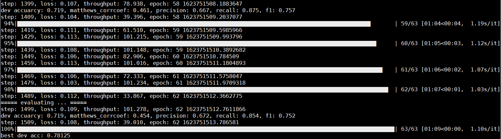

## Meta Fine-tuning
Oneflow实现[Meta Fine-tuning（MFT）](https://aclanthology.org/2020.emnlp-main.250.pdf "Meta Fine-tuning（MFT）")算法

---
## MFT概述：
在预训练语言模型的微调阶段，运用Meta learning的思想，在多个相似的domain（或task）之间学习meta knowledge，并将预训练语言模型迁移到通用的领域空间中。简单地来讲，MFT主要分为三个阶段：
- 先通过预训练语言模型获得每个domain的prototypical embedding，并计算prototypical score；
- 引入领域对抗的思想，进行meta fine-tuning，将同属于同一个domain（task）的数据通过N-way K
-shot法进行采样，并混合起来；然后进行学习domain（task）之间的通用知识；
- 对于domain（task）内的每个具体的任务，分别进行标准fine-tuning


## 数据获取
本部分将采用Oneflow静态框架实现MFT算法，数据采用MR、CR、SST-2（情感分析二分类任务），数据格式为：
> [text]\t[domain/task name]\t[label]

例如
> it 's a stale , overused cocktail using the same olives since 1962 as garnish .	SST-2	0

## 数据文件分布说明

```shell
data
├── k-shot-cross // 表示多个domain或task混合，用于Meta Fine-tuning阶段的训练和验证
│   └── g1 // 第1组domain/task
│   	└── 16-42 // k取16，random seed为42
│   		└── ofrecord // ofrecord文件
│   			├── train // 训练集
│   			│   ├── train.of_record-0 // 训练集
│   			│   └── weight.npy // 训练集每个样本的prototypical score、
│   			├── dev // 验证集
│   			│   └── dev.of_record-0 // 验证集
│   			├── train.csv // 训练集原始文件
│   			└── dev.csv // 验证集原始文件
└── k-shot-single // 表示某个domain或task，用于标准Fine-tuning阶段的训练、验证和测试
    └── SST-2 // 以SST-2数据集为例
		└── 16-42 // k取16，random seed为42
			└── ofrecord // ofrecord文件
				├── train // 训练集
				│   └── train.of_record-0 // 训练集
				├── dev // 验证集
				│   └── dev.of_record-0 // 验证集
				├── test // 测试集
				│   └── test.of_record-0 // 测试集
				├── train.csv // 训练集原始文件
				├── dev.csv // 验证集原始文件
				└── test.scv // 测试集原始文件
```


## 实验设置

#### Step1：首先获取训练样本中每个样本的prototypical score：
运行preprocess.py，在预训练的BERT模型上（uncased_L-12_H-768_A-12_oneflow），获取BERT的最后一层隐向量，并获得训练集的prototype embedding，以及各个样本的prototypical score，并保存到磁盘中；

```shell
python3 preprocess.py \
	--task_name g1 \
	--model_load_dir uncased_L-12_H-768_A-12_oneflow \ # 基于Oneflow的BERT模型
	--data_dir data/k-shot-cross/g1/16-42 \
	--num_epochs 4 \
	--seed 42 \
	--seq_length=128 \
	--train_example_num 96 \
	--dev_example_num 96 \
	--vocab_file uncased_L-12_H-768_A-12/vocab.txt \
	--resave_ofrecord
```
执行完后，将会在相应的 `data/k-shot-cross/g1/16-42` 目录下生成ofrecord目录。

#### Step2：其次进行Meta Fine-tuning

运行meta_finetuning.py，在预训练的BERT模型上（uncased_L-12_H-768_A-12_oneflow），对cross-domain/task进行微调：
```shell
python3 meta_finetuning.py \
	--task_name g1 \
	--model_load_dir uncased_L-12_H-768_A-12_oneflow \
	--data_dir data/k-shot-cross/g1/16-42 \
	--num_epochs 63 \
	--seed 42 \
	--seq_length=128 \
	--train_example_num 96 \
	--dev_example_num 96 \
	--batch_size_per_device 4 \
	--dev_batch_size_per_device 2 \
	--dev_every_step_num 100 \
	--vocab_file uncased_L-12_H-768_A-12/vocab.txt \
	--learning_rate 5e-5 \
	--resave_ofrecord
```
例如如下图，SST-2、MR、CR三个domain组成g1数据集，均为二分类任务，每个domain的class有16个样本，总共有96个样本，训练集和验证集均为96个样本，meta fine-tuning后验证集最高准确率为78.125%。微调后，将获得meta learner（oneflow模型保存在“output/model_save-2021-06-15-08:54:42/snapshot_best_mft_model_g1_dev_0.78125”中）




#### Step3：最后执行标准Fine-tuning

加载Step2生成的模型文件（例如`output/model_save-2021-06-15-08:54:42/snapshot_best_mft_model_g1_dev_0.7083333333333334`），执行标准微调

```shell
python3 finetuning.py \
	--task_name sst-2 \
	--model_load_dir output/model_save-2021-06-15-08:54:42/snapshot_best_mft_model_g1_dev_0.7083333333333334 \
	--data_dir data/k-shot-single/SST-2/16-42 \
	--num_epochs 64 \
	--seed 42 \
	--seq_length=128 \
	--train_example_num 32 \
	--dev_example_num 32 \
	--eval_example_num 872 \
	--batch_size_per_device 2 \
	--dev_batch_size_per_device 2 \
	--eval_batch_size_per_device 2 \
	--dev_every_step_num 50 \
	--vocab_file uncased_L-12_H-768_A-12/vocab.txt \
	--learning_rate 1e-5 \
	--resave_ofrecord
```

例如如下图，选择模型snapshot_best_mft_model_g1_dev_0.78125，选择SST-2数据集（训练集32个样本，测试集872个样本），然后执行标准微调，最高验证集准确率为68.75%，保存对应的模型后，在测试集上准确率为87.50%。


