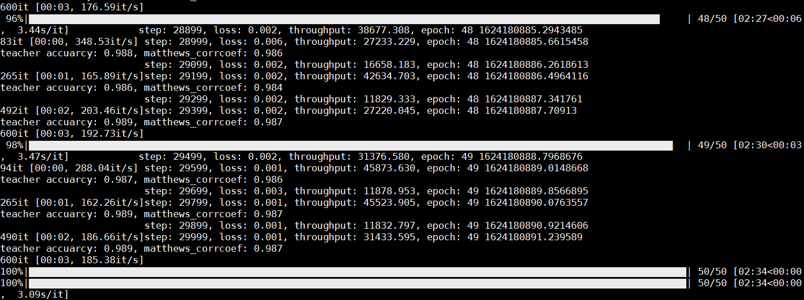
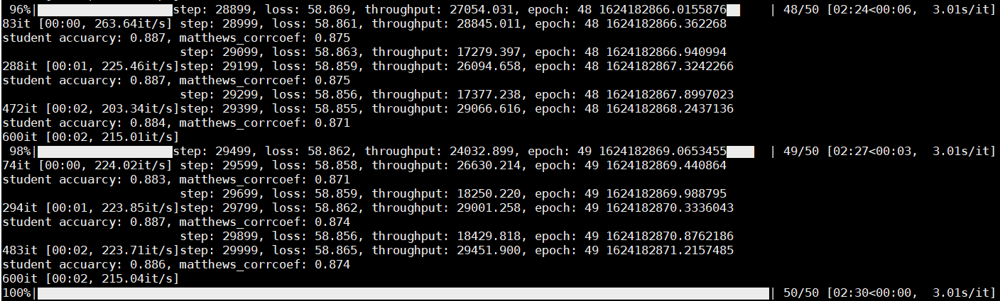

## Knowledge Distillation
Oneflow实现最基础的知识蒸馏（Knowledge Distillation, KD）算法

---
## KD概述：
为了避免超大模型不利于上线的问题，知识蒸馏旨在解决如何使用学习一个参数量较小的模型，使得其与大模型具有相当的效果。

KD主要包含两个部分，分别是Teacher和Student：
- Teacher：表示原始的大模型，通常直接在有监督数据上进行学习。在推理阶段，获得每个样本的概率分布；
- Student：表示要获得的小模型，其在Teacher模型获得每个样本的概率分布基础上进行学习，即学习Teacher模型的先验

因此简单的KD主要分为两个步骤，首先训练Teacher模型，然后训练Student模型。

## 数据获取
选择MNIST进行实验（训练集60000，测试集10000）
Oneflow已经实现了数据获取代码（ofrecord格式），因此执行后续代码将自动下载，无需手动下载。如若查看具体数据，详情：http://yann.lecun.com/exdb/mnist/


## 实验设置

#### Step1：训练Teacher模型：

```shell
python3 main.py \
	--model_type teacher \
	--epoch 10 \
	--temperature 5
```
运行效果：在测试集上最佳准确率为98.98%，模型保存至output中


#### Step2：训练Student模型：
挑选在测试集上最好的Teacher模型，然后以Teacher模型获得的soft label作为监督，训练Student模型
获取准确率最高的模型文件（例如`output/model_save-2021-06-20-09:18:50`），然后执行
```shell
python3 main.py \
	--model_type student \
	--load_teacher_from_checkpoint \
	--load_teacher_checkpoint_dir ./output/model_save-2021-06-20-09:18:50 \
	--epoch 50 \
	--temperature 5
```
运行效果：在测试集上达到89.19%。


